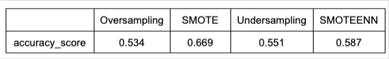
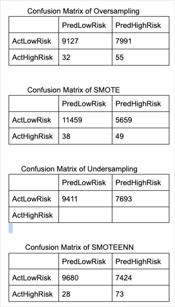
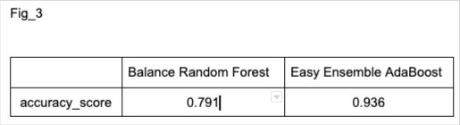
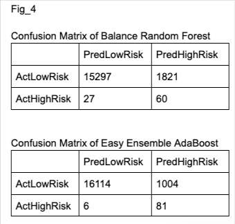
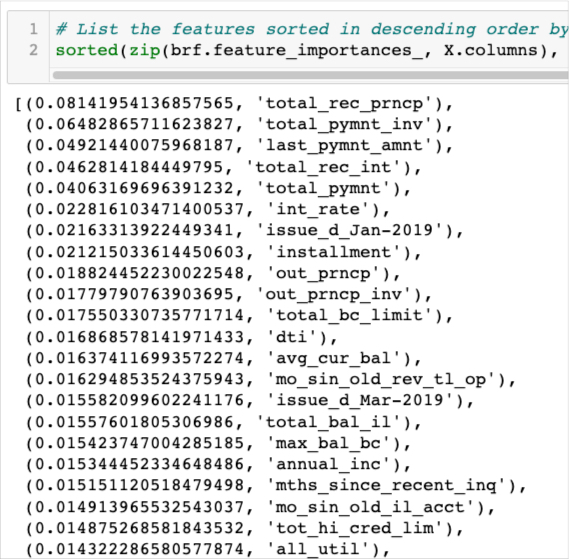

# Credit_Risk_Analysis
 The project is about application of machine lerning in credit risk analysis.
 
## Overview

Credit risk is an inherently unbalanced classification problem, as good loans easily outnumber risky loans. Therefore, we’ll employ different techniques to train and evaluate models with unbalanced classes. we are going to use imbalanced-learn and scikit-learn libraries to build and evaluate models using resampling.

The data set  from LendingClub was used.
 
 
We’ll oversample the data using the RandomOverSampler and SMOTE algorithms, and undersample the data using the ClusterCentroids algorithm. Then, we’ll use a combinatorial approach of over- and undersampling using the SMOTEENN algorithm. 

Next, will’ll compare two new machine learning models that reduce bias, BalancedRandomForestClassifier and EasyEnsembleClassifier, to predict credit risk. Once we’re done, we’ll evaluate the performance of these models and make a written recommendation on whether they should be used to predict credit risk.

*** Purpose

The purpose of the work is to create different classification models and evaluate their performance to get an accurate model for credit risk analysis.

## Results

### Resampling 

The logisticRegression model was created by using diffent sampling methods.They are Random Oversampling, SMOTE Oversampling,  Undersampling and combination of Over and Undersampling (SMOTEENN).

Accuracy Score table:

Confusion Matrices:

In addition to these, The Calssification reports for each sampling were created in the code.
Yo can find the code in the following link:

### Ensembly Models

Two ensemble method were applied in order to classifay risk status, they are Balenced Random Forest Classifier and Easy Ensemble AdaBoost Classifier.

Accuracy Score table:

Confusion Matrices:

The importance of features was also found out:

In addition to these, The Calssification reports for each sampling were created in the code.
Yo can find the code in the following link:

## Summary
